# NetPilot

[](LICENSE)
[](https://github.com/Ekkh1300/NetPilot/releases)
[](https://developer.android.com)
[](https://learn.microsoft.com/dotnet/core/project-sdk/dependencies)

**English** · [فارسی](README.fa.md)

**Network control for Android, and a companion app for Windows.**
DNS you choose and test yourself, live traffic you can actually see, per-app bandwidth
caps, scheduled limits — and a phone VPN tunnel that can be shared with a Windows PC.

Two apps, one repository:

| | |
|---|---|
| `NetPilotMobile/` | Android app — Kotlin + Jetpack Compose |
| `NetPilot/` | Windows app — .NET 8 + WPF, plus its installer |
| `NetPilot.Tests/` | Unit and integration tests for the Windows side |

<p align="center">
  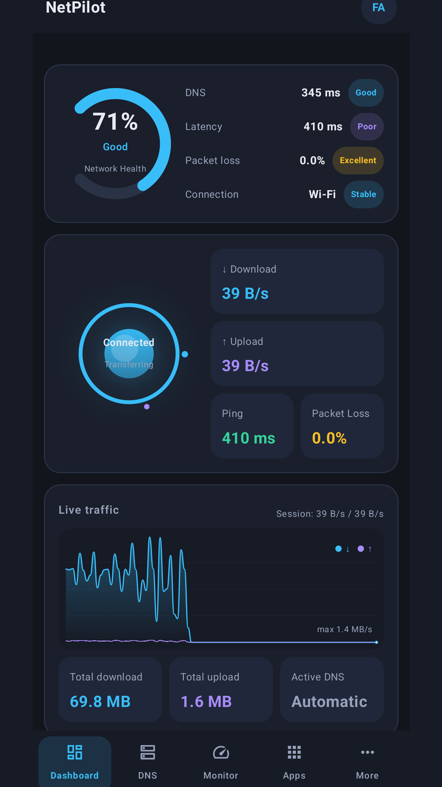
  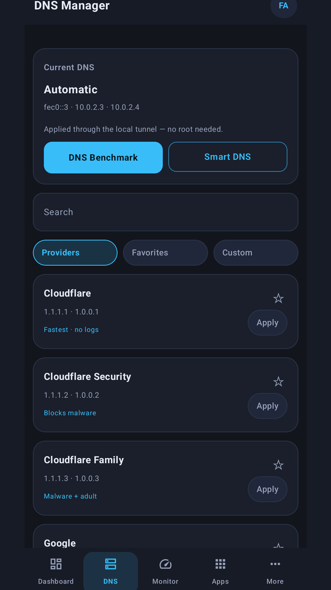
  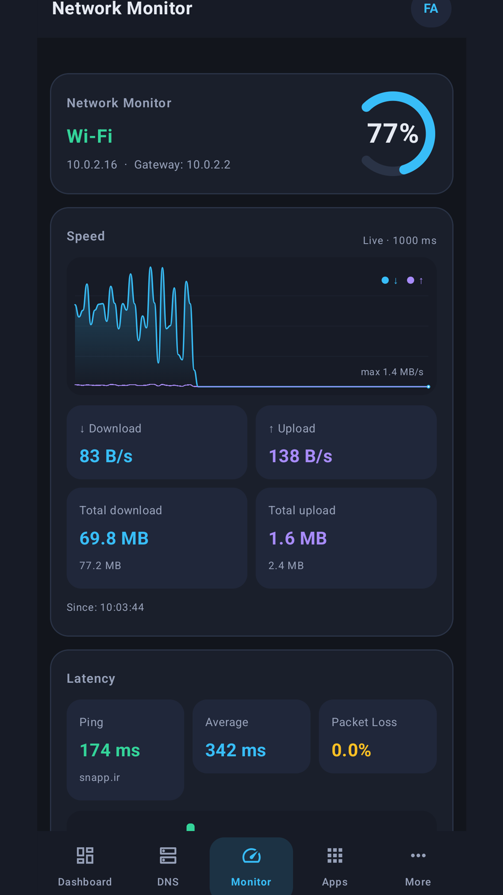
  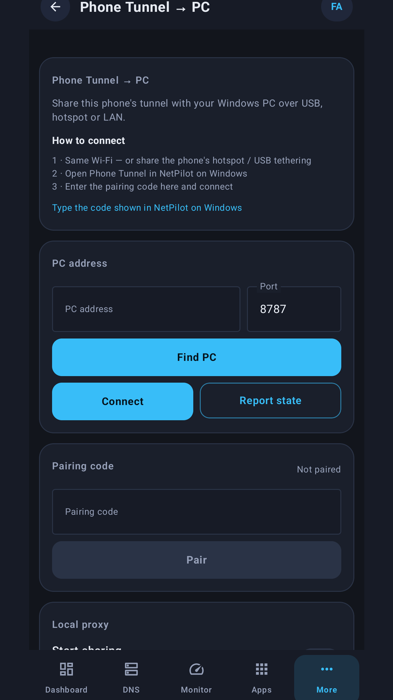
</p>

## Screenshots

### Android

| | |
|---|---|
| 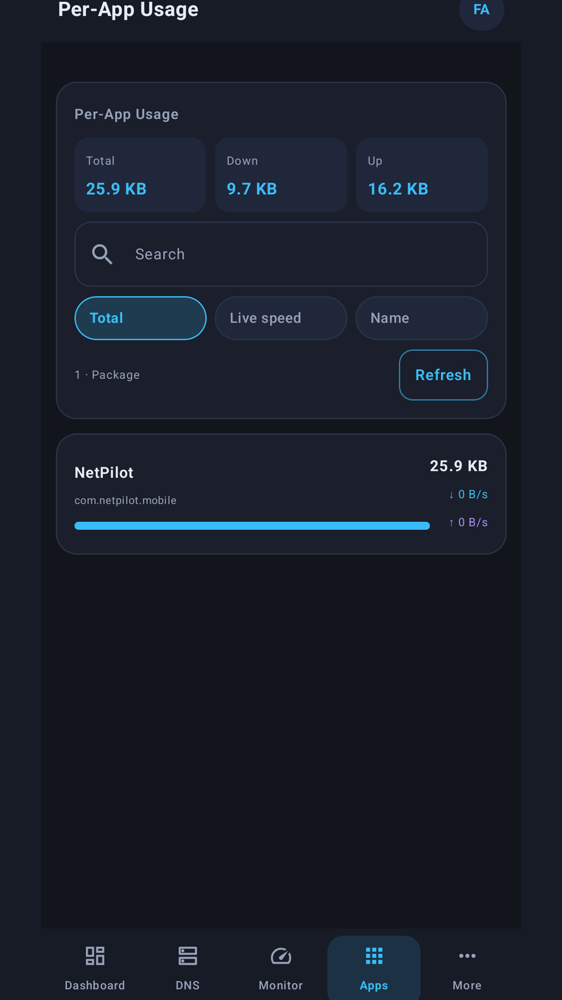 | 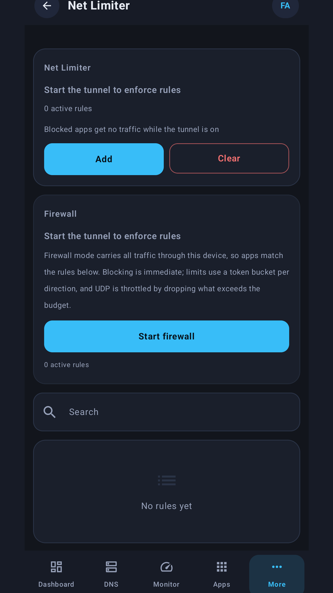 |
| 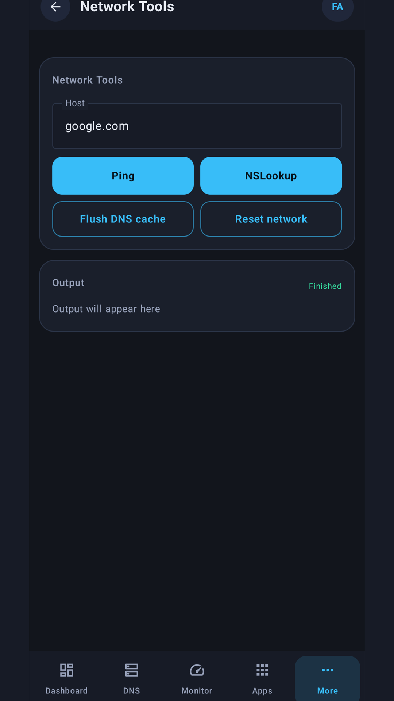 | 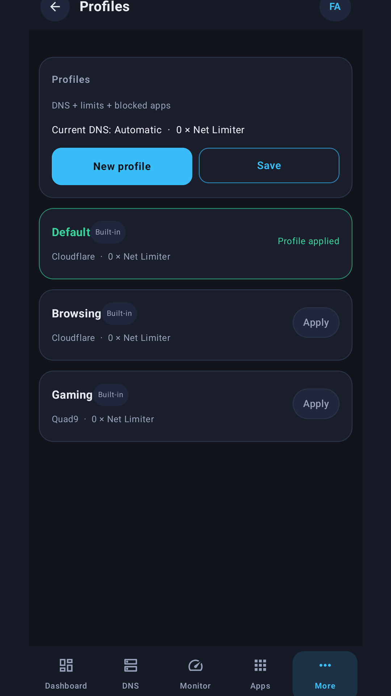 |

### Windows

| | |
|---|---|
| 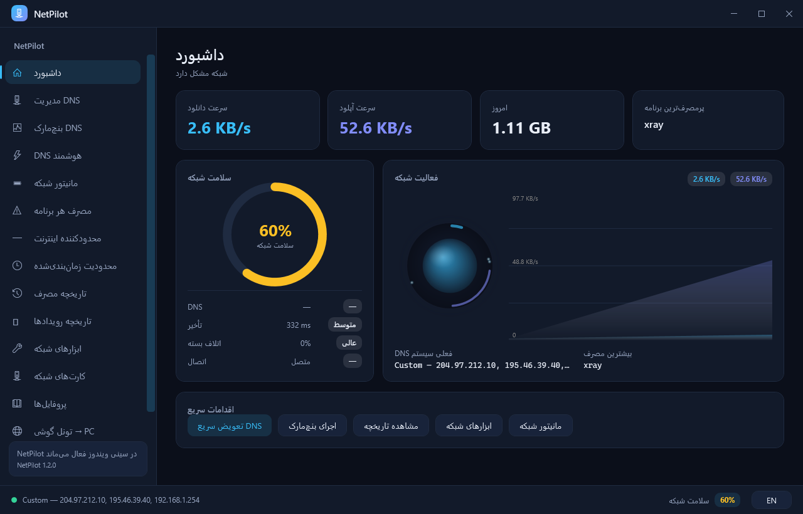 | 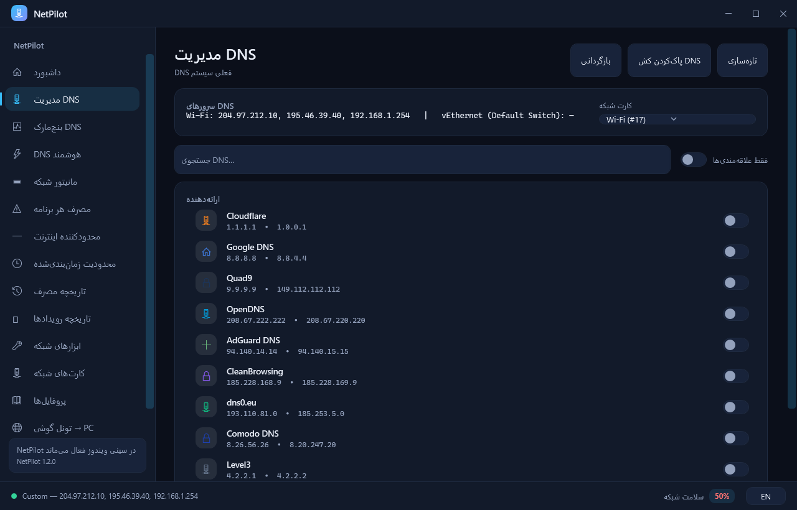 |
| 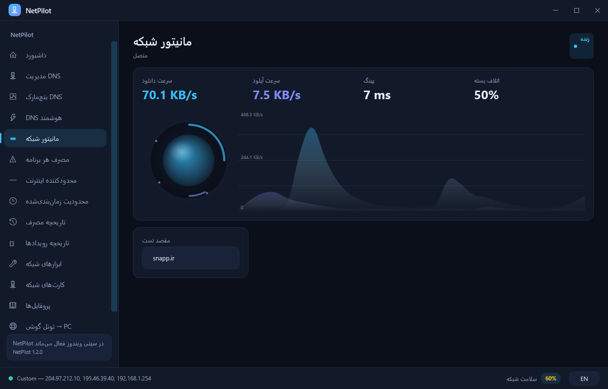 | 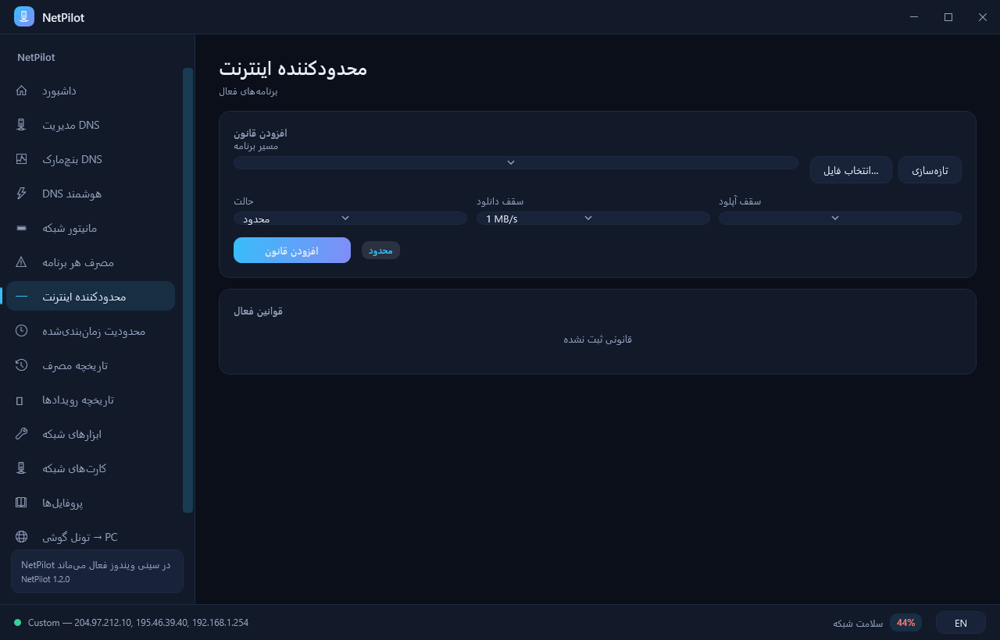 |
| 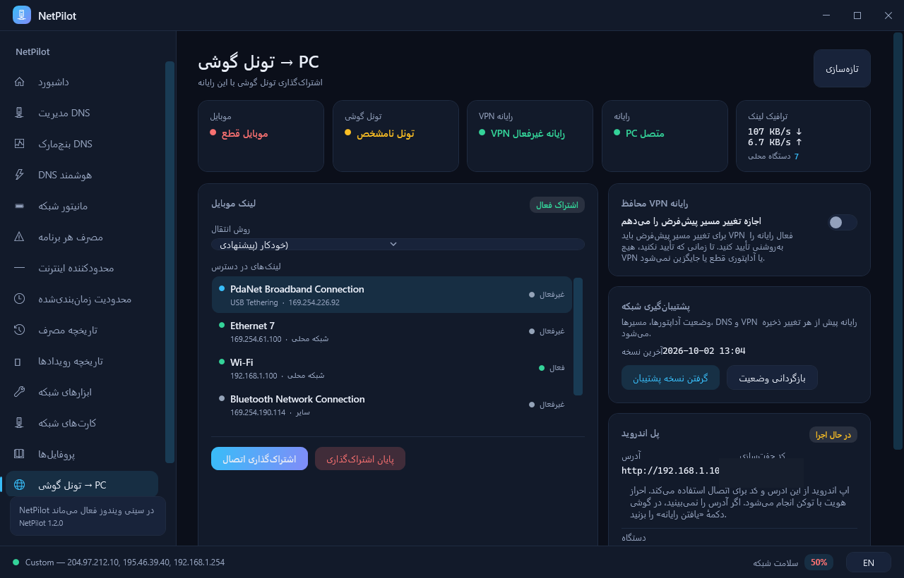 | 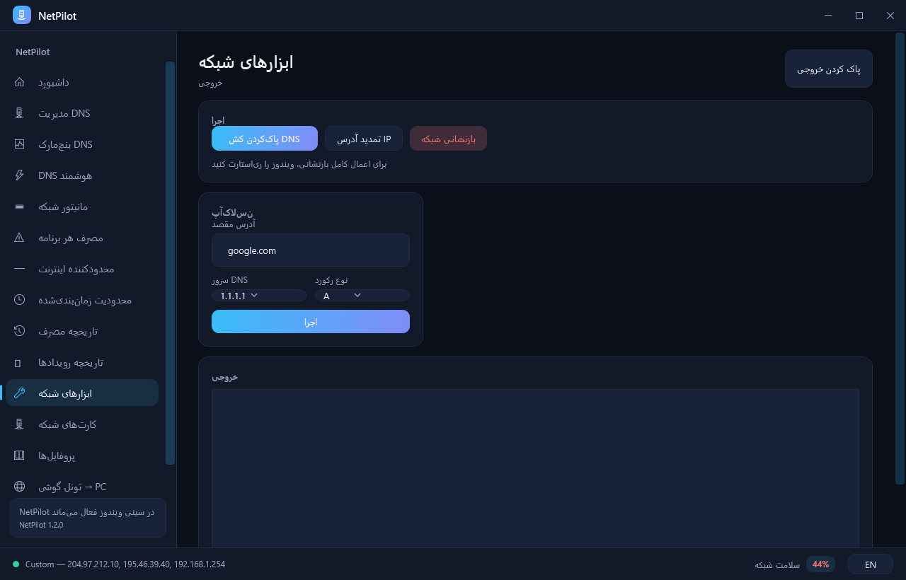 |

---

## Android app

* **Network health dashboard** — one score for DNS quality, latency, packet loss and link
  stability, next to a live traffic chart and running totals.
* **DNS manager** — curated resolvers plus your own, each benchmarked for response time,
  with a one-tap restore of whatever was configured before.
* **Live monitor** — download/upload charts from a one-second to a one-hour window.
* **Per-app usage** — who is actually downloading, sorted by volume.
* **Internet limiter** — a download/upload cap per app, or block it outright. The caps are
  enforced in the tunnel, not just displayed.
* **Scheduled limits** — rules that apply during chosen hours of the day.
* **Profiles** — build a configuration once, export it, import it anywhere.
* **Network tools** — ping, nslookup, DNS cache flush and reset, inside the app.
* **Local VPN tunnel** — two modes: *DNS only* (just queries go through your chosen path,
  everything else is untouched) and *Full tunnel* (all traffic follows that path). If the
  path fails the app falls back to the normal one, so the phone never loses connectivity.
* **Phone Tunnel → PC** — hand this phone's VPN tunnel to a Windows machine over a shared
  Wi-Fi, the phone's hotspot, USB tethering or an ADB link.

Fully bilingual (English / Persian, including RTL), dark theme throughout.
No location, files or camera permissions. Usage access is only needed for the per-app
usage table and stays optional.

## Windows app

Same toolset as a desktop app: dashboard with health scoring, DNS management with backup
and restore, live network monitor, per-app usage, an internet limiter (real Windows QoS
policies for upload, a token bucket for download), scheduled and time-based limits, event
and connection history, network tools, adapter inventory, and the **Phone Tunnel → PC**
page that pairs with the Android app and lets the desktop browse through the phone.

The Windows app runs elevated (`requireAdministrator`) and opens its own firewall rule for
the bridge port, removing it again on uninstall.

---

## How the phone → PC tunnel works

```
Android app  ──HTTP :8787 (control)──▶  Windows bridge
Android app  ◀──HTTP :8788 (data)───   Windows proxy
                                            │
                                            ▼
                                     phone VPN tunnel ──▶ internet
```

* The desktop listens on **8787**; the phone runs a small HTTP proxy on **8788** that
  tunnels `CONNECT` byte-for-byte and the desktop points WinHTTP/WinINET at it.
* Every socket that proxy opens is put back **into** the phone's tunnel with
  `VpnService.protect()` — the app excludes its own package from the tunnel to avoid loops,
  so without that the desktop would end up on the phone's real IP instead of its VPN.
* Four supported paths: shared Wi-Fi, phone hotspot, USB tethering, and
  `adb reverse tcp:8787 tcp:8787` for development.
* Android allows one VPN app at a time, so either NetPilot's own tunnel runs (full-tunnel
  mode) or another VPN client runs and NetPilot's tunnel stays off. Either way the desktop
  ends up inside whichever VPN the phone is using.

**What it is not:** the desktop bridge is a proxy, not an IP-level gateway. Programs that
honour the system proxy (browsers, most apps) go through the phone; anything opening raw
sockets or using UDP/QUIC does not. Android also never forwards packets that arrive on
Wi-Fi into an app's tunnel, which is why "route mode" cannot work here by design.

---

## Building

### Android

```bash
cd NetPilotMobile
./gradlew lintDebug testDebugUnitTest assembleDebug assembleRelease
```

* `minSdk 26` (Android 8.0) · `targetSdk 36` · Kotlin + Compose · Java 17
* Universal APK: `arm64-v8a`, `armeabi-v7a`, `x86`, `x86_64`

**Signing:** the release keystore is *not* in this repository. Copy
`keystore.properties.example` to `keystore.properties` and fill it in, or export
`NETPILOT_STORE_FILE`, `NETPILOT_STORE_PASSWORD`, `NETPILOT_KEY_ALIAS` and
`NETPILOT_KEY_PASSWORD` (what CI should do). Without either, `assembleRelease` still
builds — the APK is simply unsigned.

Generate a keystore once with:

```bash
keytool -genkeypair -v -keystore netpilot-release.jks -alias netpilot \
        -keyalg RSA -keysize 2048 -validity 10000
```

### Windows

```powershell
dotnet build NetPilot\NetPilot.csproj
```

* .NET 8, WPF, `net8.0-windows` · Windows 10 1607+ / Windows 11
* Requires administrator rights to install and run

Installer (self-contained, no .NET needed on the target machine):

```powershell
powershell -ExecutionPolicy Bypass -File installer\build.ps1
# -> dist\NetPilot-Setup.exe
```

---

## Testing

```powershell
# Everything: Windows tests, Android tests + lint, and a check that the suite left the
# machine's firewall, proxy and routing untouched.
powershell -ExecutionPolicy Bypass -File NetPilot\Tools\verify.ps1

# Also run the Windows tests elevated - two suites change the real DNS servers and the
# real Windows QoS policies, then put everything back.
powershell -ExecutionPolicy Bypass -File NetPilot\Tools\verify.ps1 -Elevated

# End-to-end installer test: install -> run -> uninstall
powershell -ExecutionPolicy Bypass -File NetPilot\Tools\verify.ps1 -Installer
```

| Suite | Where | Count |
|---|---|---|
| Android unit tests | `NetPilotMobile/app/src/test/` | 92 |
| Windows unit tests | `NetPilot.Tests/` | 43 |
| Installer end-to-end | `NetPilot/installer/test.ps1` | install / run / uninstall |

The Windows suite includes integration tests that drive the real networking stack: they
apply a DNS resolver and assert the adapter comes back byte-identical, and they create and
remove an actual Windows QoS policy.

---

## Repository layout

```
NetPilotMobile/          Android app
  app/src/main/java/com/netpilot/mobile/
    vpn/                 tunnel, packet relay, firewall, limiter engine
    net/                 DNS forwarding, queries, health scoring
    pc/                  desktop bridge client, LAN discovery, LAN proxy server
    data/                repository, settings, strings
  app/src/test/          JVM unit tests
NetPilot/                Windows app (.NET 8 + WPF)
  Services/              background services and the HTTP bridge
  ViewModels/            MVVM view models
  Lang/                  bilingual string tables
  installer/             single-file installer (built with the in-box C# compiler)
  Tools/                 icon, feature graphic, screenshot and verify scripts
NetPilot.Tests/          Windows unit and integration tests
docs/                    documentation and screenshots
```

---

## Releases

Binaries are published as GitHub **Release assets**, not committed:
`NetPilot-<version>-release.apk`, `NetPilot-Windows-<version>-Setup.exe` and the
`SHA256SUMS.txt` for them.

---

## Security notes

* **Never commit `keystore.properties`, `*.jks` or `*.keystore`.** Whoever holds the
  signing key can ship an update that phones install as if it came from us. Both are in
  `.gitignore`; if either has already been pushed, rotate the key.
* The Windows bridge authenticates with a token that is regenerated on every app start and
  issued only against a six-digit code shown in the UI, with five failed attempts per
  minute before it has to be re-issued.
* Pairing attempts are rate limited; unauthenticated requests are rejected before any
  handler runs.
* Before any change to the PC's network, the app snapshots interface metrics, routes, DNS
  and proxy state, and can put them back.

---

## License

MIT — see [LICENSE](LICENSE).